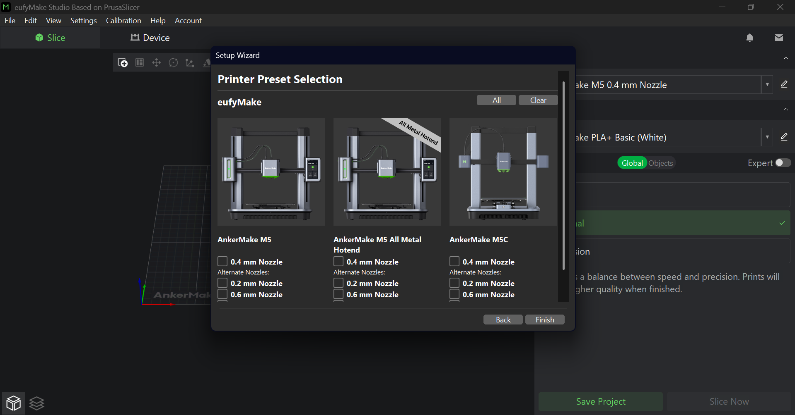
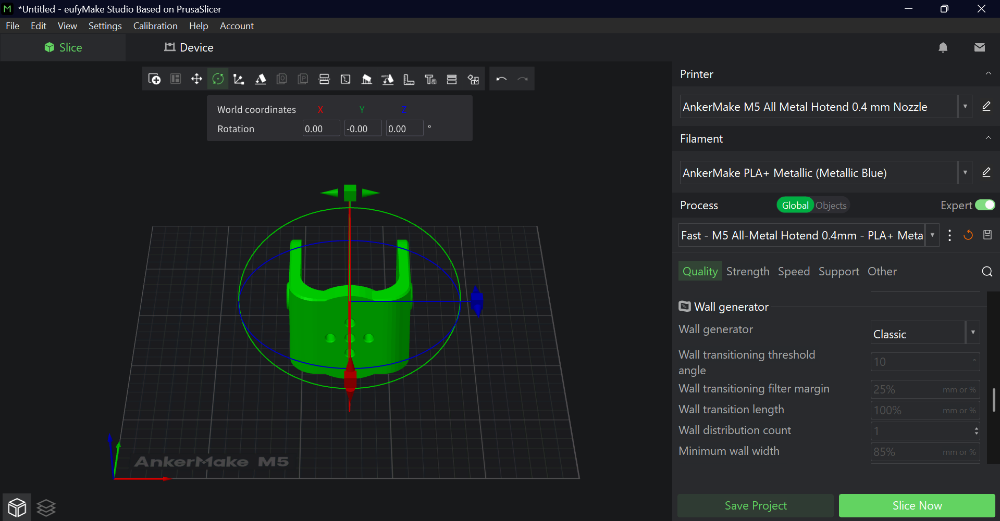
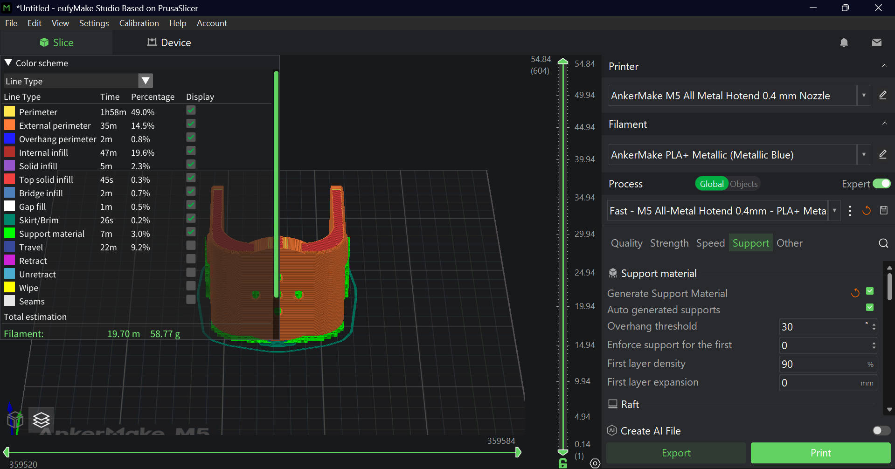

# Elbow Joint Test in AnkerMake

This task is about converting the robot arm joint design to STL format, slicing it in AnkerMake Studio, selecting the best printing material, and documenting the process.

## Steps

1. Started by downloading **[eufyMake Studio](https://www.eufymake.com/eufymake-studio?srsltid=AfmBOoriMVKhK--Y9ZWkDDQKiMGYHfV-nNkhsOkenRmGKbc6JUl27bW4)** 

2. After launching the software, the **AnkerMake M5 All Metal Hotend** with a **0.4 mm nozzle** was selected. This choice allows higher printing temperatures for stronger materials like PETG or ABS, while the 0.4 mm nozzle offers a good balance between precision and strength.
   

3. After completing the Elbow Joint design in SolidWorks with customized fillets, chamfers, base cut-outs for weight reduction, and a custom logo, the model was exported to **STL** format.  
   The STL file was then opened in **eufyMake Studio**, and the print settings were adjusted to ensure maximum strength based on the part’s dimensions (65 × 68 × 8 mm, wall thickness 6 mm):
- **Layer Height: 0.1 mm** – finer layer resolution for better detail.  
- **Strength – Wall Loops: 6** – increases wall thickness for higher part strength.  
- **Top Shell Layers: 7** – creates a more solid and durable top surface.  
- **Bottom Surface Pattern: Concentric** – improves bed adhesion and gives a cleaner bottom finish.  
- **Fill – Sparse Infill Density: 15%** – balances weight, material usage, and internal strength.
- **Material:** AnkerMake PLA+ Metallic (Metallic Blue) – chosen for good print quality, durability, and ease of printing.

## Printer and Filament Setup & Model Orientation 
The elbow joint model was oriented vertically to minimize overhangs and avoid printing large sections in mid-air, which improves print strength and reduces the need for excessive support material.

## Support material settings configured for printing the elbow joint

